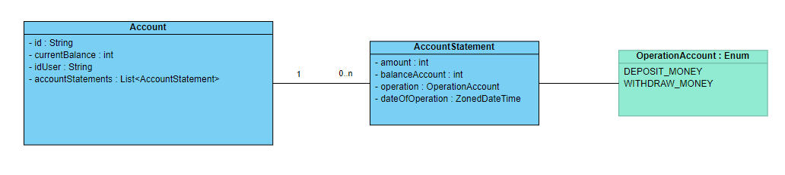
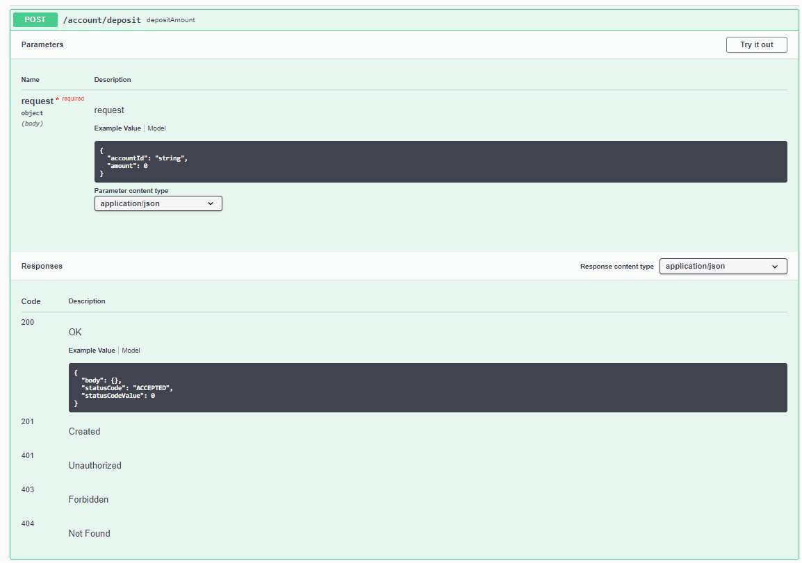
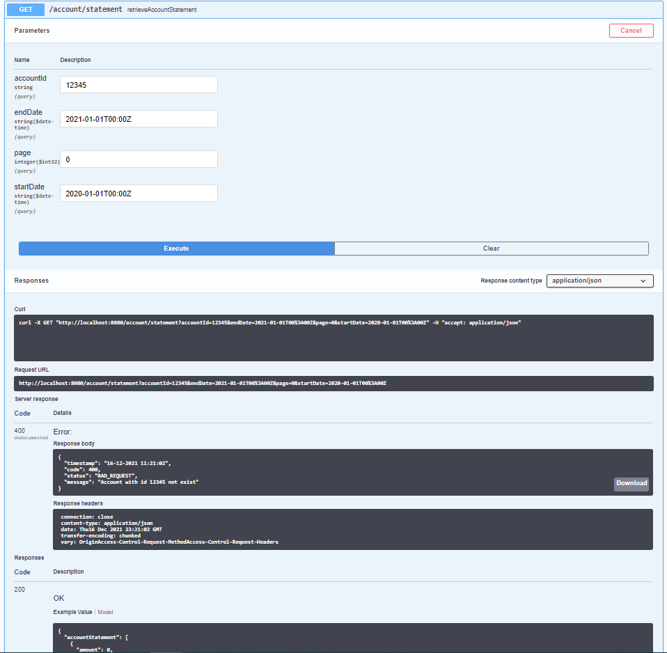
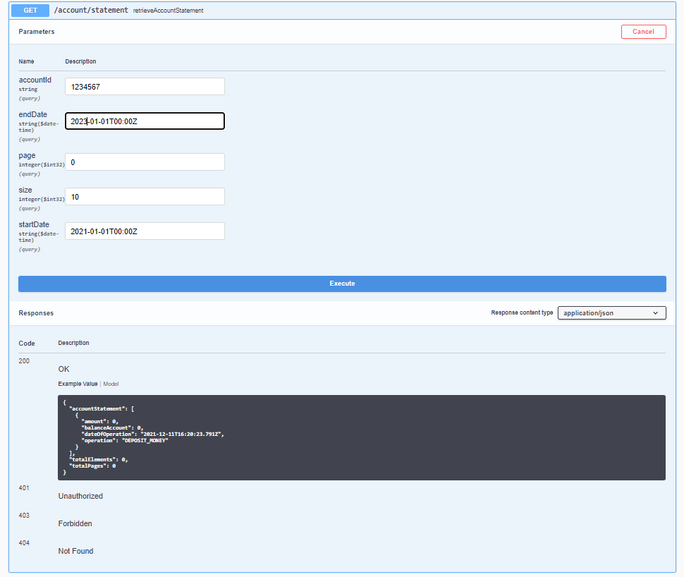
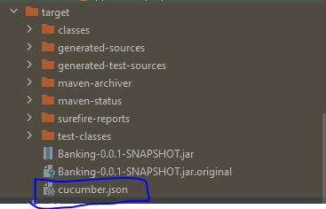
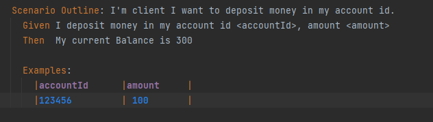
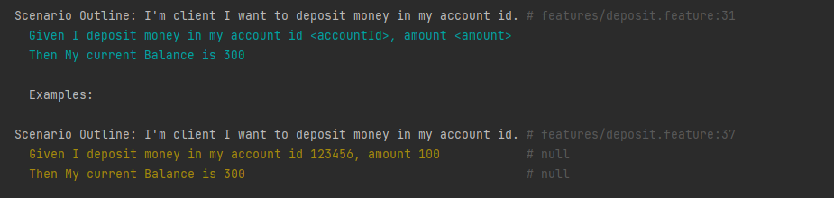

# Bank account kata

The Bank Kata project is implemented to describe the basic functionality of a Banking Application

## User Stories

```bash
'US1'

In order to save money
As a bank client
I want to make a deposit in my account

'US 2':

In order to retrieve some or all of my savings
As a bank client
I want to make a withdrawal from my account

'US 3':

In order to check my operations
As a bank client
I want to see the history (operation, date, amount, balance) of my operations
```

## Requirements

```bash
Deposit and Withdrawal
Account statement (date, amount, balance)
Statement printing
The expected result is a service API, and its underlying implementation, that meets the expressed needs.
Nothing more, especially no UI, no persistence
```

## Class diagram



## Project Structure

```bash

    ├── src
       ├── main
          ├── java
             ├── com.kata.Bank
                ├── config
                ├── exceptions
                   ├── filter
                ├── models
                   ├── enumeration
                ├── repositories
                ├── rest
                   ├── controller
                   ├── mapper
                   ├── request
                   ├── response
                ├── service
                   ├── impl
              
          ├── resources
          
       ├── test
          ├── java
             ├── com.kata.Bank
                ├── BDD
                ├── rest.controller
                ├── service.impl
          ├── resources
                ├── features

    ├── pom.xml
    └── README.md
```

## Technology

```text
   Java 8 
   Spring Boot
```

## TDD

```text
   Junit 
   Mockito
```

## TDD Structure

```bash
   ├── test
          ├── java
             ├── com.kata.Bank
                ├── rest.controller
                    ├── AccountControllerIT : integration test
                    ├── AccountControllerIT : unit test 
                ├── service.impl
                    ├── AccountControllerIT : unit test 
                
```

## BDD

To create BDD scenario with cucumber so you should to add ***cucumber*** dependancy

  ```text
  
  	<!-- cucumber-dependency -->
  	
		<dependency>
			<groupId>io.cucumber</groupId>
			<artifactId>cucumber-java</artifactId>
			<version>5.0.0-RC1</version>
		</dependency>
		<dependency>
			<groupId>io.cucumber</groupId>
			<artifactId>cucumber-junit</artifactId>
			<version>5.0.0-RC1</version>
		</dependency>
		<dependency>
			<groupId>io.cucumber</groupId>
			<artifactId>cucumber-spring</artifactId>
			<version>5.0.0-RC1</version>
		</dependency>
		
		<!-- cucumber-dependency -->
		
  
  ```

## BDD Structure

```bash 
       ├── test
          ├── java
             ├── com.kata.Bank
                ├── BDD
                    ├── CucumberRunnerTest
                    ├── DepositStep
                    ├── WithdrawStep 
                    ├── RetrieveAccountStatementStep
          ├── resources
                ├── features
                    ├── deposit.feature
                    ├── retrieveAccountStatementStep.feature
                    ├── withdrawStep.feature
                                      
```

## Getting Started

To run this project, please follow those steps

1. Clone the project.
```text
   git clone https://github.com/sabrinezouaghui/Banking.git
   
```
or download the project

2. Run the build command :

```text
  mvn clean install
   
```
3. Run the application

```text
   mvn spring-boot:run
   
```
or run the jar 
```text
   cd target
   
   java -jar Banking-0.0.1-SNAPSHOT.jar

   
```
4. To execute the unit and bdd tests:
```text
  mvn test

```

## Documentation

When the server is running you can access the API Swagger at this URL:

```text
    http://localhost:8080/swagger-ui/
```

1 **/account/deposit** : With this API, you can deposit money on your bank account

### Prerequises

- **accountId** is required.
- If the given **accountId** is not found, otherwise an exception will be thrown.
- The **amount** should be positive, otherwise an exception will be thrown.

### Swagger


2 **/account/withdraw** : With this API, you can withdraw money on your bank account

### Prerequises

- **accountId** is required.
- If the given **accountId** is not found, otherwise an exception will be thrown.
- The **amount** should be positive, otherwise an exception will be thrown.

### Swagger



3 **/account/statement** : With this API, you can retrieve Account Statement

### Prerequises
- ***accountId*** is required.
- If the given **accountId** is not found, otherwise an exception will be thrown.
- ***page*** is required.
- If the given **page** is negative, otherwise an exception will be thrown.
- ***size*** is required.
- If the given **endDate** before **startDate**, otherwise an exception will be thrown.

### Swagger



## BDD Documentation

When you run BDD test, Report will be generated 



## BDD Test example



## BDD Test Result




##ZOUAGHI Sabrine
